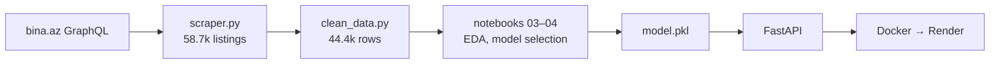
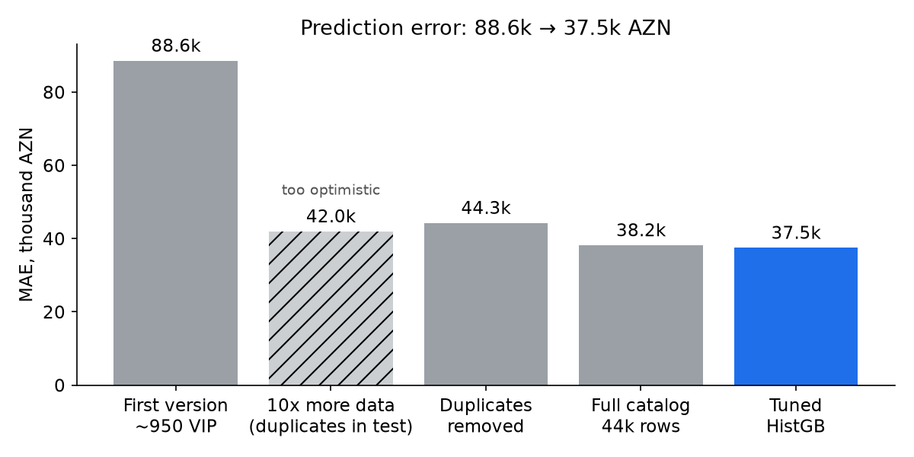
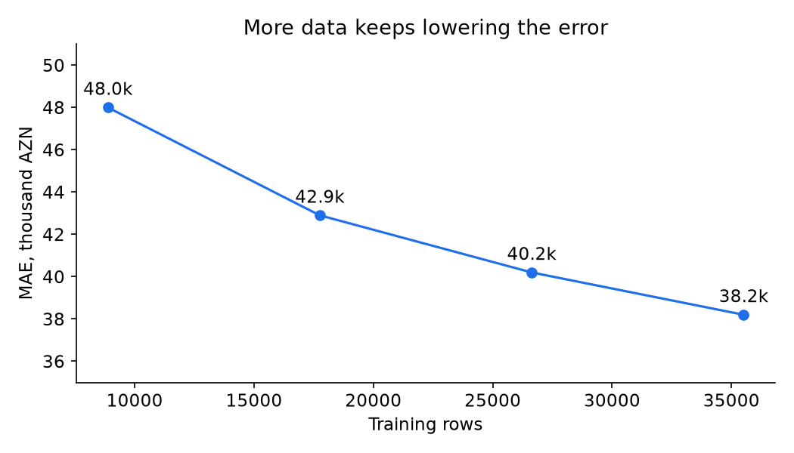
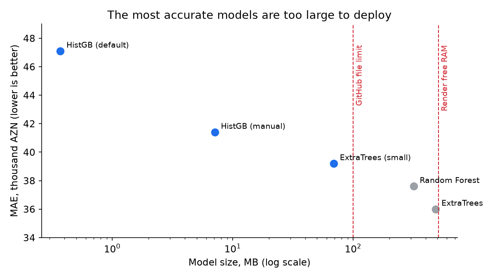

# Home Price Prediction

Predicts apartment sale prices in Baku from listings scraped from bina.az.

**Live demo:** https://home-price-prediction-ae4m.onrender.com/static/index.html
(free Render tier: the first request after 15 idle minutes can take about a minute)

## Results

| Metric | Value |
|---|---|
| MAE | ~37,500 AZN |
| R² | 0.832 |
| MAPE | 11.5% |
| Model | HistGradientBoosting (Optuna-tuned), 27 MB |
| Data | 44,382 listings (full bina.az sale catalog, Oct 2026) |

Measured on a 20% hold-out not used for training or tuning.

## Pipeline



- `scripts/scraper.py` — full `SearchItems` catalog, 25 listings per page (server maximum), retries on errors.
- `scripts/clean_data.py` — drops non-apartments, unrealistic prices, missing districts and duplicates; prints rows left after each step.
- `scripts/01–04_*.ipynb` — model development, in order (first model → more data → EDA → model selection).
- `api/main.py` — `/predict` and `/locations`; `static/` — the form; `api/Dockerfile` — the container.

## How the model improved



- **Duplicates.** ~10% of listings were the same property re-posted. Copies in both train and test made the 42k score too optimistic; removing them gave an honest 44.3k.
- **More data.** The error was still falling as training data grew, so the full catalog was scraped: 44.3k → 38.2k with the same model.



- **Model choice.** LazyPredict compared ~40 models; tree ensembles and boosting led. The forests were the most accurate but far too large to deploy:



- **Tuning.** HistGradientBoosting was tuned with Optuna (40 trials) and compared with a smaller ExtraTrees on the hold-out:

| Model | MAE | RMSE | R² | Size |
|---|---|---|---|---|
| ExtraTrees (small) | 40,216 | 114,876 | 0.779 | 56 MB |
| **HistGradientBoosting (tuned)** | **37,456** | **100,104** | **0.832** | **27 MB** |

Numbers from different steps come from different test sets: they show the direction and size of each change, not exact differences.

## Features

`rooms`, `area`, `floor`, `floors`, `hasRepair`, district (83 one-hot columns; districts with < 5 listings → `Other`), and `isVipped` / `isFeatured`.

The VIP flags correlate with price only because owners of pricier apartments pay for promotion more often, so the API fixes them to a constant: otherwise a user could raise their own prediction just by ticking "VIP".

## Limitations

- **Baku only:** 98.4% of listings are in Baku; other cities are unreliable.
- **Repair vs new buildings:** for a typical apartment repair adds ~22.5k AZN, but in the historic centre (Sahil, Nizami, Nəsimi, Xətai) the model often predicts a *lower* price with repair: there "no repair" usually means a new, expensive building sold without finishing. A new-build/resale feature would fix this (see `05_feature_importance.ipynb`).
- **Duplicate detection is approximate:** identical apartments in the same building may be removed as duplicates.

## Run locally

```
# data
pip install -r scripts/requirements-scraper.txt
python scripts/scraper.py
python scripts/clean_data.py

# training (notebooks) and README charts
pip install -r scripts/requirements-train.txt
python scripts/make_readme_charts.py

# API
pip install -r api/requirements-api.txt
uvicorn api.main:app --reload

# API in Docker
docker build -f api/Dockerfile -t home-price-api .
docker run -p 8000:8000 home-price-api
```

Each part has its own virtual environment; see the `requirements-*.txt` files.